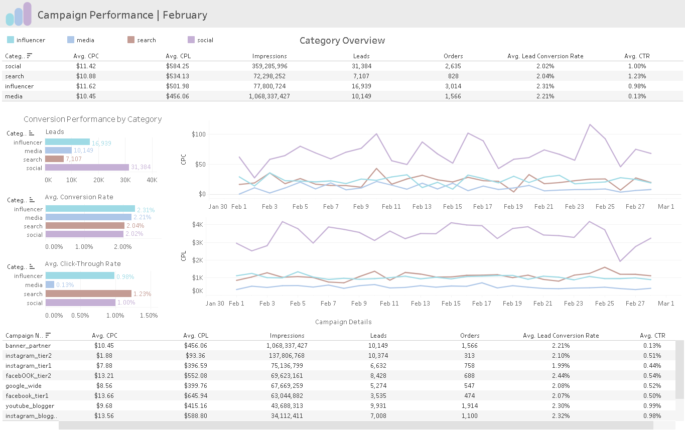
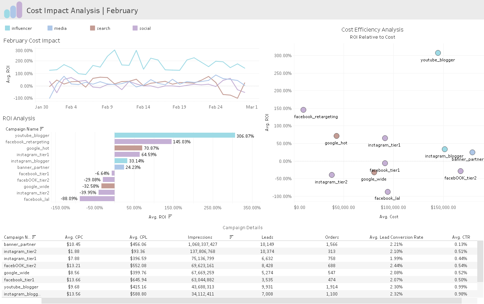
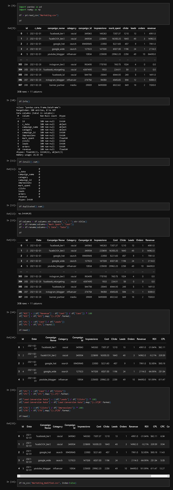

Table of Contents
=================
- [Project Overview](#project-overview)
- [Summary of Insights](#summary-of-insights)
- [Recommendations](#recommendations)
- [Technical Overview](#technical-overview)

Project Overview
===============

This project provides a basic monthly performance analysis of digital media marketing campaign engagement during the month of February. The purpose is to provide a holistic view of February's marketing KPI's, as well as provide a cost impact analysis, and identify areas for potential optimization in budget allocation.

Interactive dashboards can be found [here](https://public.tableau.com/app/profile/max.d4182/viz/MarketingCampaignPerformanceAnalysis_17275645130830/CampaignPerformanceDashboard).

Summary of Insights
-------------------

- Search campaigns boast the highest click-through rate (CTR), despite generating the fewest leads, suggesting strong audience engagement despite limited overall reach.
- Campaigns with higher budgets do not always correlate with better performance. This implies a need for more efficient budget allocation across different channels.
- Social media campaigns show high conversion rates but lower-than-expected return on investment (ROI), suggesting potential inefficiencies.
- Multimedia campaigns consistently generate the highest number of impressions but exhibit significantly lower click-through rates (CTR) compared to other channels.
- Influencer campaigns drive both higher lead conversion and return on investment (ROI), but cost efficiency is mixed.

Recommendations
---------------

- Explore opportunities to refine or scale search campaigns for a more conversion-ready audience, with the goal of boosting leads without affecting click-through rates.
- Further analysis is warranted to explore the scalability of high-performing, cost-efficient campaigns.
- Implement more A/B testing across channels to refine messaging, creative content, and ad placement, with the goal of identifying what drives better ROI.
- Investigation into the discrepancy between social media campaign's strong conversion rate and suboptimal cost efficiency could reveal opportunities for optimization.
- For multimedia campaigns, focus on improving click-through rates by adjusting calls-to-action, design, and positioning within high-traffic sites.

Technical Overview
------------------

Dataset can be found [here](https://www.kaggle.com/datasets/sinderpreet/analyze-the-marketing-spending/data)

Python and Pandas were used to evaluate and improve the dataset’s quality, which involved identifying and handling missing or duplicate values, cleaning, and organizing the data to ensure it was ready for analysis. From the original dataset, some key metrics were calculated such as Cost per Click (CPC), Cost per Lead (CPL), and Click-Through Rate (CTR) to support deeper insights. The pre-processing was minimal, but essential in ensuring the dataset was structured for efficient analysis and visualization.

